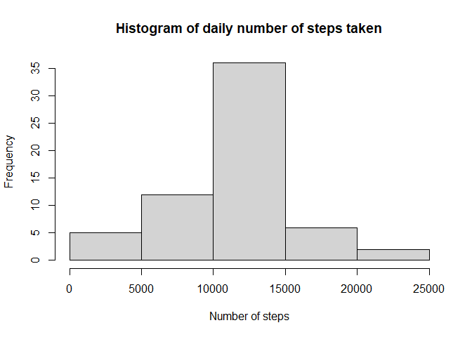

## Loading and preprocessing the data

```r
#Read in the data
activity <- read.csv("activity.csv")

#compute the daily total number of steps
daily.sum.steps <- tapply(activity$steps, activity$date, sum, na.rm=TRUE)

#Create data frame with average number of steps per interval and the interval
#value.
interval.av.steps <- tapply(activity$steps, activity$interval, mean, na.rm=TRUE)
time.interval <- unique(activity$interval)
interval.df <- data.frame(av.steps= interval.av.steps, interval=time.interval)
```

## Histogram of total number of steps taken each day


```r
hist(daily.sum.steps, main="Histogram of daily number of steps taken", 
     xlab="Nubmer of steps")
```

<!-- -->

## Mean and median number of steps taken each day


```r
mean.steps <- mean(daily.sum.steps)
mean.steps
```

```
## [1] 9354.23
```

```r
median.steps <- median(daily.sum.steps)
median.steps
```

```
## [1] 10395
```
The mean number of steps taken daily is 9354.2295082 and the median number of steps taken daily is 10395.

## Time Series plot of average number of steps taken per time interval


```r
library(ggplot2)
```

```
## Warning: package 'ggplot2' was built under R version 4.0.3
```

```r
ggplot(interval.df, aes(x=interval, y=av.steps)) + geom_line() +
  labs(y="Average number of steps")
```

<!-- -->
## Find the interval that contains the maximum average number of steps


```r
interval.df$interval[interval.df$av.steps==max(interval.df$av.steps)]
```

```
## [1] 835
```

The interval with the largest average number of steps is from 8:35-8:40 in the morning.

## Imputing missing values

### Count the number of NA values


```r
num.NA <- sum(is.na(activity$steps))
num.NA
```

```
## [1] 2304
```

There are 2304 missing values in the data set.

### Replace the missing values with the average of the non-missing values for that 5 minute interval


```r
imputed.activity <- activity

#Replace the NA's with the average from that time interval over all days
for(i in 1:length(activity$steps)) {
  if(is.na(activity$steps[i]))  {
    imputed.activity$steps[i] <- 
      interval.df$av.steps[interval.df$interval==activity$interval[i]]
  } 
}

#Compute daily sum of steps for this new data set

imputed.daily.sum.steps <- tapply(imputed.activity$steps, imputed.activity$date, sum, na.rm=TRUE)
```

### Create the histogram and compute the mean and median of this new data set


```r
hist(imputed.daily.sum.steps, main="Histogram of daily number of steps taken",
     xlab ="Number of steps")
```

<!-- -->

```r
mean(imputed.daily.sum.steps)
```

```
## [1] 10766.19
```

```r
median(imputed.daily.sum.steps)
```

```
## [1] 10766.19
```


## Are there differences in activity patterns between weekdays and weekends?

### Create a factor variable for weekend vs. weekday


```r
imputed.activity$day <- weekdays(as.Date(imputed.activity$date))
for (i in 1:length(imputed.activity$day)){
  if(imputed.activity$day[i]=="Saturday") {
    imputed.activity$week[i] <- "weekend"
  }  else if(imputed.activity$day[i] =="Sunday") {
    imputed.activity$week[i] <- "weekend" 
  }  else {
    imputed.activity$week[i] <- "weekday"
  }
}

imputed.activity$week <- as.factor(imputed.activity$week)
```

### Create data frames for plots


```r
weekday.av.steps <- tapply(imputed.activity$steps[imputed.activity$week == "weekday"], 
                   imputed.activity$interval[imputed.activity$week =="weekday"],  mean, na.rm=TRUE)
weekend.av.steps <- tapply(imputed.activity$steps[imputed.activity$week == "weekend"], 
                   imputed.activity$interval[imputed.activity$week =="weekend"],  mean, na.rm=TRUE)

weekday.df <- data.frame(av.steps = weekday.av.steps, day = rep("weekday",times=length(weekday.av.steps)), interval=time.interval)
weekend.df <- data.frame(av.steps = weekend.av.steps, day = rep("weekend",times=length(weekend.av.steps)), interval=time.interval)

week.df <- rbind(weekday.df, weekend.df)
```

### Plot the data


```r
ggplot(week.df, aes(x=interval, y=av.steps)) + geom_line() + facet_grid(day~.) +
  labs(y="Average steps")
```

<!-- -->


